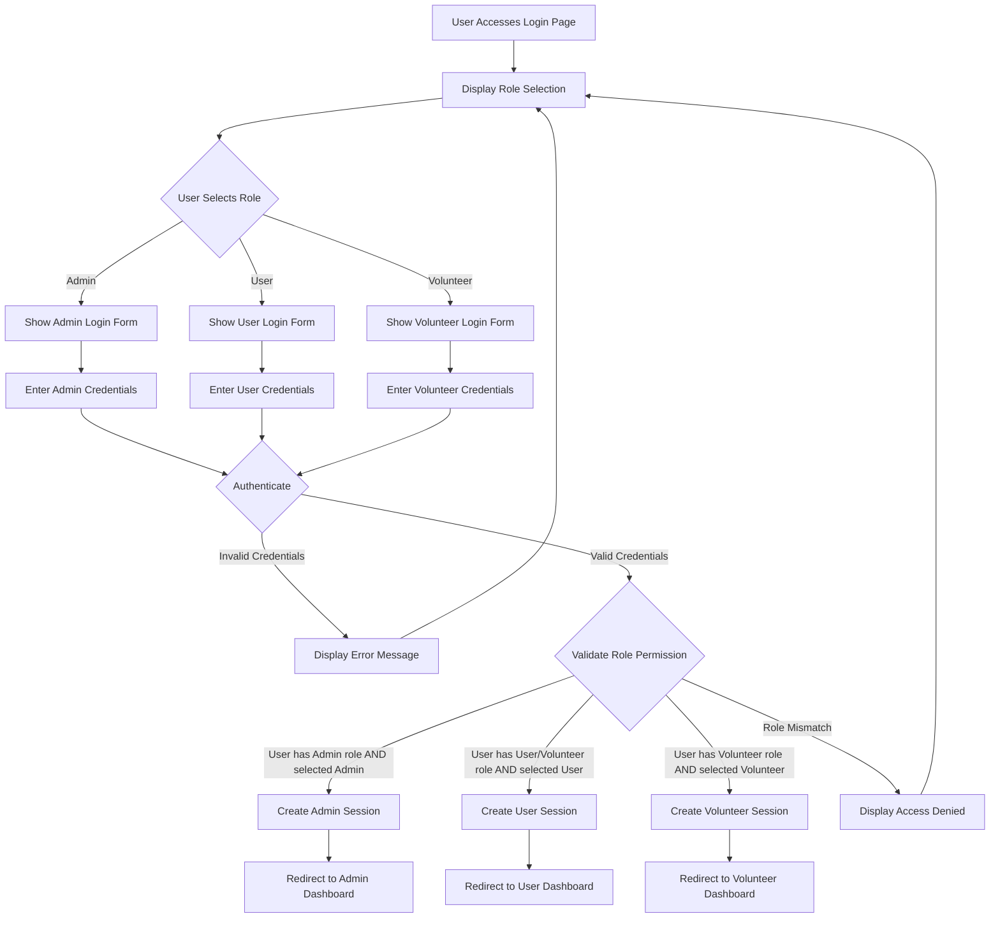
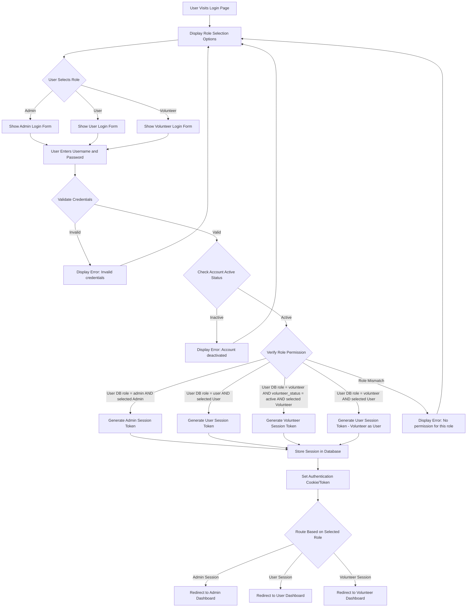
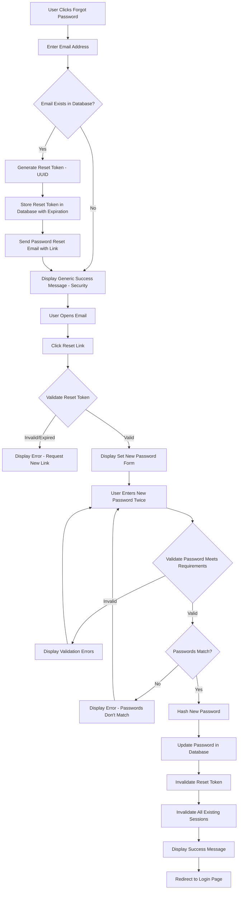

# Admin Module and Multi-Role System Design

## 1. Design Overview

This design establishes a three-tier role-based access control system for the Smart Complaint Portal featuring Admin, User (Citizen), and Volunteer roles. The system provides role selection at login, comprehensive admin visibility across all existing system features, dedicated feedback analysis capabilities, and user-to-volunteer conversion functionality.

### Strategic Goals

- Implement three distinct user roles with granular permission levels
- Enable role-based login with explicit role selection by users
- Provide administrators with complete system oversight including all current features
- Introduce comprehensive feedback analysis module for data-driven insights
- Allow citizens to voluntarily convert to volunteer status for community engagement

### System Scope

The design enhances the existing Smart Complaint Portal by adding:
- Role-based authentication and authorization framework
- Admin interface with full system access and feedback analysis
- User interface for complaint submission, tracking, and analysis
- Volunteer interface for community-based complaint verification and support
- User-to-volunteer conversion workflow

## 2. Role Definition and Access Control

### 2.1 Role Hierarchy

The system implements three primary roles with distinct responsibilities and permissions:

#### Admin Role

**Purpose**: System administration, oversight, and strategic management

**Capabilities**:
- Full access to all existing system features (spam filtering, classification, recurrence detection, routing, reports, analytics, settings)
- Complete visibility into all complaints regardless of ownership
- User management across all roles
- Department and routing configuration
- System settings and parameters configuration
- Access to feedback analysis module
- Audit trail and compliance reporting
- ML model management and monitoring
- Data export and reporting capabilities

**Restrictions**: None - unrestricted system access

#### User (Citizen) Role

**Purpose**: Submit and manage personal complaints

**Capabilities**:
- Submit new complaints with full details
- Track own complaints and view status updates
- View ML analysis results for own complaints
- Submit feedback on resolved complaints
- Manage personal profile and preferences
- View analysis and insights for own complaints
- Convert to volunteer role through opt-in process

**Restrictions**:
- Cannot view other users' complaints
- Cannot access system configuration
- Cannot perform administrative functions
- Cannot access aggregate analytics or reports

#### Volunteer Role

**Purpose**: Community engagement and complaint verification support

**Capabilities**:
- All user role capabilities (submit and track own complaints)
- View public complaints in designated geographic areas
- Verify complaint legitimacy and provide ground truth
- Add supporting evidence to existing complaints
- Vote on complaint priority or severity
- Provide community insights on recurring issues
- Access community-level analytics for assigned areas

**Restrictions**:
- Cannot modify other users' complaints
- Cannot access sensitive personal information
- Cannot perform administrative or routing functions
- Limited to assigned geographic regions or categories

### 2.2 Permission Matrix

| Feature / Action | Admin | User | Volunteer |
|-----------------|-------|------|-----------|
| Submit Complaint | Yes | Yes | Yes |
| View Own Complaints | Yes | Yes | Yes |
| View All Complaints | Yes | No | Partial (public/assigned area) |
| Update Complaint Status | Yes | No | No |
| Forward Complaints | Yes | No | No |
| Access Spam Filtering | Yes | No | No |
| Access Classification Module | Yes | No | No |
| Access Recurrence Detection | Yes | No | Partial (view only) |
| Access Routing & Escalation | Yes | No | No |
| Access Reports Module | Yes | No | No |
| Access Analytics Module | Yes | No | Partial (community analytics) |
| Access Feedback Analysis | Yes | No | No |
| Manage Users | Yes | No | No |
| Configure Settings | Yes | No | No |
| Submit Feedback | Yes | Yes | Yes |
| Verify Complaints | No | No | Yes |
| Convert to Volunteer | No | Yes | N/A |
| Export Data | Yes | No | No |

## 3. Data Model

### 3.1 Users Table

| Field Name | Data Type | Constraints | Description |
|------------|-----------|-------------|-------------|
| user_id | VARCHAR(36) | PRIMARY KEY | Unique user identifier (UUID) |
| username | VARCHAR(100) | UNIQUE, NOT NULL | Login username |
| email | VARCHAR(255) | UNIQUE, NOT NULL | User email address |
| password_hash | VARCHAR(255) | NOT NULL | Hashed password (bcrypt/Argon2) |
| full_name | VARCHAR(255) | NOT NULL | User's full name |
| phone_number | VARCHAR(20) | - | Contact phone number |
| role | VARCHAR(20) | NOT NULL | User role (admin, user, volunteer) |
| is_active | BOOLEAN | DEFAULT TRUE | Account active status |
| volunteer_status | VARCHAR(20) | - | Volunteer application status (pending, approved, active) |
| volunteer_region | VARCHAR(100) | - | Assigned geographic region for volunteers |
| volunteer_categories | JSONB | - | Assigned complaint categories for volunteers |
| created_at | TIMESTAMP | DEFAULT CURRENT_TIMESTAMP | Account creation timestamp |
| updated_at | TIMESTAMP | DEFAULT CURRENT_TIMESTAMP | Last update timestamp |
| last_login | TIMESTAMP | - | Last successful login |
| converted_from_user_at | TIMESTAMP | - | Timestamp when user converted to volunteer |

**Indexes**:
- CREATE INDEX idx_users_email ON users(email)
- CREATE INDEX idx_users_role ON users(role)
- CREATE INDEX idx_users_volunteer_status ON users(volunteer_status)

### 3.2 Sessions Table

| Field Name | Data Type | Constraints | Description |
|------------|-----------|-------------|-------------|
| session_id | VARCHAR(36) | PRIMARY KEY | Unique session identifier |
| user_id | VARCHAR(36) | FOREIGN KEY (users) | References users table |
| token | VARCHAR(255) | UNIQUE, NOT NULL | Authentication token (JWT) |
| selected_role | VARCHAR(20) | NOT NULL | Role selected at login |
| ip_address | VARCHAR(45) | - | User's IP address |
| user_agent | TEXT | - | Browser/client information |
| expires_at | TIMESTAMP | NOT NULL | Session expiration time |
| created_at | TIMESTAMP | DEFAULT CURRENT_TIMESTAMP | Session creation timestamp |

**Indexes**:
- CREATE INDEX idx_sessions_token ON sessions(token)
- CREATE INDEX idx_sessions_user_id ON sessions(user_id)

### 3.3 Volunteer Conversion Requests Table

| Field Name | Data Type | Constraints | Description |
|------------|-----------|-------------|-------------|
| request_id | VARCHAR(36) | PRIMARY KEY | Unique request identifier |
| user_id | VARCHAR(36) | FOREIGN KEY (users) | User requesting conversion |
| motivation | TEXT | - | User's reason for volunteering |
| preferred_regions | JSONB | - | Geographic areas of interest |
| preferred_categories | JSONB | - | Complaint categories of interest |
| status | VARCHAR(20) | DEFAULT 'pending' | Request status (pending, approved, rejected) |
| reviewed_by | VARCHAR(36) | FOREIGN KEY (users) | Admin who reviewed request |
| review_notes | TEXT | - | Admin's review comments |
| requested_at | TIMESTAMP | DEFAULT CURRENT_TIMESTAMP | Request submission timestamp |
| reviewed_at | TIMESTAMP | - | Review completion timestamp |

### 3.4 Feedback Table

| Field Name | Data Type | Constraints | Description |
|------------|-----------|-------------|-------------|
| feedback_id | VARCHAR(36) | PRIMARY KEY | Unique feedback identifier |
| complaint_id | VARCHAR(36) | FOREIGN KEY (complaints) | Associated complaint |
| user_id | VARCHAR(36) | FOREIGN KEY (users) | User who submitted feedback |
| rating | INTEGER | CHECK (rating >= 1 AND rating <= 5) | Overall rating (1-5 stars) |
| resolution_satisfaction | INTEGER | CHECK (rating >= 1 AND rating <= 5) | Resolution satisfaction (1-5) |
| process_satisfaction | INTEGER | CHECK (rating >= 1 AND rating <= 5) | Process satisfaction (1-5) |
| response_time_rating | INTEGER | CHECK (rating >= 1 AND rating <= 5) | Response time rating (1-5) |
| comments | TEXT | - | User's detailed feedback comments |
| suggestions | TEXT | - | Improvement suggestions |
| sentiment_score | DECIMAL(3,2) | - | ML-derived sentiment score (-1 to 1) |
| sentiment_class | VARCHAR(20) | - | Sentiment classification (positive, neutral, negative) |
| created_at | TIMESTAMP | DEFAULT CURRENT_TIMESTAMP | Feedback submission timestamp |

**Indexes**:
- CREATE INDEX idx_feedback_complaint_id ON feedback(complaint_id)
- CREATE INDEX idx_feedback_rating ON feedback(rating)
- CREATE INDEX idx_feedback_created_at ON feedback(created_at)

### 3.5 Volunteer Actions Table

| Field Name | Data Type | Constraints | Description |
|------------|-----------|-------------|-------------|
| action_id | VARCHAR(36) | PRIMARY KEY | Unique action identifier |
| volunteer_id | VARCHAR(36) | FOREIGN KEY (users) | Volunteer who performed action |
| complaint_id | VARCHAR(36) | FOREIGN KEY (complaints) | Related complaint |
| action_type | VARCHAR(50) | NOT NULL | Type of action (verify, support_evidence, priority_vote) |
| verification_status | VARCHAR(20) | - | Verification result (legitimate, suspicious, spam) |
| evidence_url | TEXT | - | URL to supporting evidence |
| priority_vote | INTEGER | - | Priority vote (1-5) |
| notes | TEXT | - | Volunteer's notes |
| created_at | TIMESTAMP | DEFAULT CURRENT_TIMESTAMP | Action timestamp |

### 3.6 Enhanced Complaints Table

Extend existing complaints table with additional fields:

| Field Name | Data Type | Constraints | Description |
|------------|-----------|-------------|-------------|
| submitted_by | VARCHAR(36) | FOREIGN KEY (users) | User who submitted complaint |
| citizen_name | VARCHAR(255) | - | Name of complainant |
| citizen_contact | VARCHAR(100) | - | Contact information |
| is_verified | BOOLEAN | DEFAULT FALSE | Volunteer verification status |
| verified_by | VARCHAR(36) | FOREIGN KEY (users) | Volunteer who verified |
| verified_at | TIMESTAMP | - | Verification timestamp |
| volunteer_priority_score | DECIMAL(3,2) | - | Aggregated volunteer priority votes |

## 4. Login Page Design

### 4.1 Login Interface Structure

The login page provides a unified entry point with explicit role selection capability.

**Page Layout Components**:
- System branding and logo
- Role selection interface
- Credential input form
- Authentication actions
- Account creation option
- Password recovery link

### 4.2 Role Selection Mechanism

Users explicitly choose their role before or during authentication.

**Role Selection Options**:

The interface presents three role cards/buttons:

**Admin Option**:
- Visual indicator: Shield or crown icon
- Label: "Administrator"
- Description: "System management and oversight"
- Access requirement: Admin credentials required

**User Option**:
- Visual indicator: Person icon
- Label: "Citizen"
- Description: "Submit and track complaints"
- Access requirement: Any registered user

**Volunteer Option**:
- Visual indicator: Helping hands icon
- Label: "Volunteer"
- Description: "Community support and verification"
- Access requirement: Approved volunteer status

### 4.3 Login Flow

### 4.4 Role Validation Logic

**Validation Rules**:

When user attempts to log in with a selected role:

- Verify credentials are valid (username/email and password match)
- Check account is active
- Validate user's assigned role(s) in database
- Confirm selected role is permitted for the user:
  - Admin role: User must have role = 'admin'
  - User role: User can have role = 'user' OR role = 'volunteer'
  - Volunteer role: User must have role = 'volunteer' AND volunteer_status = 'active'
- Create session with selected_role in session table
- Generate role-appropriate authentication token
- Redirect to corresponding dashboard

**Error Handling**:
- If credentials invalid: Display "Invalid username or password"
- If account inactive: Display "Account has been deactivated"
- If role mismatch: Display "You do not have permission to access this role"
- If volunteer not approved: Display "Your volunteer application is pending approval"

### 4.5 Visual Design Approach

**Role Selection View**:
- Three equally prominent role cards arranged horizontally
- Each card contains icon, title, brief description
- Hover effect to indicate interactivity
- Selected role highlighted with accent color
- Responsive design collapses to vertical stack on mobile

**Login Form View**:
- Clean, minimal design focused on credentials
- Selected role displayed prominently at top
- Username/email field
- Password field with visibility toggle
- Remember me checkbox
- Sign in button with role-specific color
- Back button to return to role selection
- Links to forgot password and create account

## 5. Admin Module Features

The admin module provides complete access to all existing system features plus new feedback analysis capabilities.

### 5.1 Admin Dashboard

Comprehensive system overview integrating all operational metrics.

**Dashboard Components**:

**Metrics Overview Panel**:
- Total complaints (all-time and current period)
- Complaints by status breakdown
- Complaints by category distribution
- Resolution rate and average time
- SLA compliance percentage
- Spam detection statistics
- Active users and volunteers count
- Feedback submission rate

**Existing System Features Access**:
- Quick access cards to all modules:
  - Submit Complaint (admin can submit on behalf)
  - Spam Filtering
  - Classification
  - Recurrence Detection
  - Routing & Escalation
  - Reports
  - Analytics
  - Settings
  - Feedback Analysis (new)

**Activity Feed**:
- Real-time complaint submissions
- Status changes and escalations
- Volunteer verifications
- Feedback submissions
- System alerts and notifications

**System Health Indicators**:
- Database performance metrics
- ML model accuracy scores
- API response times
- Error rates and warnings

### 5.2 Spam Filtering Module (Admin Access)

Full visibility and control over spam detection system.

**Features**:
- View all complaints with spam scores
- Filter by spam score thresholds
- Review ML spam predictions
- Manually mark as spam or legitimate
- Override automated spam decisions
- Configure spam detection sensitivity
- Retrain spam detection model
- View spam detection accuracy metrics
- Analyze false positives and false negatives

### 5.3 Classification Module (Admin Access)

Complete access to complaint categorization system.

**Features**:
- View all complaint classifications
- See ML predicted categories and confidence scores
- Manually reclassify complaints
- Override automated classifications
- Configure classification rules
- Manage category taxonomy
- Train classification model with new data
- Analyze classification accuracy
- Export classification reports

### 5.4 Recurrence Detection Module (Admin Access)

Full control over recurring complaint pattern identification.

**Features**:
- View all detected clusters
- Analyze cluster characteristics (location, category, frequency)
- See complaints grouped by cluster
- Configure clustering parameters (distance threshold, time window)
- Manually merge or split clusters
- Mark clusters as recurring issues
- Assign priority to recurring patterns
- Generate recurrence reports
- Export cluster data for analysis

### 5.5 Routing & Escalation Module (Admin Access)

Complete management of complaint assignment and escalation workflows.

**Features**:
- View all complaint assignments
- See department workload distribution
- Forward complaints to departments
- Reassign complaints between officers
- Escalate priority levels
- Configure routing rules and logic
- Define SLA parameters by category/priority
- Set up automatic escalation triggers
- Monitor SLA compliance
- Manage department and officer directory
- Undo forwarding actions (within time window)
- Batch forwarding operations
- View routing history and audit trail

### 5.6 Reports Module (Admin Access)

Comprehensive reporting capabilities across all system data.

**Report Types**:

**Operational Reports**:
- Daily/weekly/monthly complaint summary
- Department performance report
- SLA compliance report
- Resolution time analysis
- Category distribution report
- Geographic distribution report

**ML Performance Reports**:
- Spam detection accuracy report
- Classification model performance
- Recurrence detection effectiveness
- Prediction confidence analysis

**User Activity Reports**:
- User registration and activity
- Volunteer contribution report
- Feedback submission statistics
- Login and session analytics

**Custom Reports**:
- Custom query builder
- Multi-dimensional filtering
- Aggregation and grouping options
- Visualization selection (charts, tables, maps)
- Export formats (PDF, Excel, CSV, JSON)
- Scheduled report generation
- Report sharing and distribution

### 5.7 Analytics Module (Admin Access)

Advanced data analysis and visualization capabilities.

**Analytics Features**:

**Trend Analysis**:
- Complaint volume trends over time
- Category trend analysis
- Geographic trend mapping
- Seasonal pattern identification

**Performance Analytics**:
- Department performance comparison
- Officer workload and efficiency
- Resolution time distributions
- SLA performance tracking

**Predictive Analytics**:
- Complaint volume forecasting
- Resource demand prediction
- Recurring issue prediction
- Escalation risk assessment

**Comparative Analytics**:
- Period-over-period comparison
- Department benchmarking
- Category performance comparison
- Geographic region comparison

**Visualization Options**:
- Line charts for trends
- Bar charts for comparisons
- Pie charts for distributions
- Heat maps for geographic data
- Scatter plots for correlations
- Interactive dashboards with drill-down

### 5.8 Settings Module (Admin Access)

System-wide configuration and parameter management.

**Configuration Categories**:

**General Settings**:
- System name and branding
- Contact information
- Operating hours
- Supported languages
- Default timezone

**User Management Settings**:
- Password policy rules
- Account lockout parameters
- Session timeout duration
- Registration approval workflow

**Notification Settings**:
- Email server configuration
- SMS gateway settings
- Notification templates
- Alert thresholds and triggers

**ML Configuration**:
- Spam score threshold
- Classification confidence threshold
- Recurrence clustering parameters
- Auto-routing confidence requirement
- Model retraining schedule

**SLA Settings**:
- Default SLA deadlines by priority
- Department-specific SLA overrides
- SLA warning thresholds
- Breach notification rules

**Integration Settings**:
- API keys and endpoints
- Third-party service configurations
- Webhook configurations
- Data export schedules

### 5.9 Feedback Analysis Module (New Feature)

Dedicated module for comprehensive feedback data analysis and insights generation.

#### 5.9.1 Feedback Overview Dashboard

**Key Metrics Display**:
- Total feedback submissions count
- Average overall rating (1-5 stars)
- Average resolution satisfaction score
- Average process satisfaction score
- Average response time rating
- Feedback submission rate (percentage of resolved complaints with feedback)
- Sentiment distribution (positive, neutral, negative percentages)

**Trend Visualizations**:
- Feedback volume over time (daily, weekly, monthly)
- Average rating trends
- Sentiment trend analysis
- Feedback rate trend

#### 5.9.2 Rating Analysis

**Overall Rating Breakdown**:
- Distribution of 1-5 star ratings (bar chart or histogram)
- Percentage breakdown by rating level
- Identify most common rating
- Rating variance analysis

**Multi-Dimensional Rating Analysis**:
- Resolution satisfaction distribution
- Process satisfaction distribution
- Response time rating distribution
- Correlation analysis between different rating dimensions
- Identify areas of strength and weakness

**Rating Filters**:
- Filter by date range
- Filter by complaint category
- Filter by department
- Filter by priority level
- Filter by geographic region

#### 5.9.3 Sentiment Analysis

**Sentiment Classification**:
- ML-based sentiment analysis of feedback comments
- Sentiment score calculation (-1 to 1 scale)
- Categorization into positive, neutral, negative
- Display sentiment distribution

**Sentiment Insights**:
- Most common positive feedback themes
- Most common negative feedback themes
- Sentiment correlation with ratings
- Department-wise sentiment comparison
- Category-wise sentiment analysis

**Word Cloud Visualization**:
- Generate word clouds from feedback comments
- Separate clouds for positive and negative feedback
- Highlight frequently mentioned terms
- Identify emerging issues or praise

#### 5.9.4 Department Performance via Feedback

**Department Comparison**:
- Average rating by department
- Feedback volume by department
- Sentiment distribution by department
- Resolution satisfaction by department
- Process satisfaction by department

**Department Rankings**:
- Top performing departments
- Departments needing improvement
- Trend analysis for each department
- Benchmark against system average

**Officer-Level Analysis** (if officer information tracked):
- Individual officer feedback scores
- Officer performance comparison
- Identify top performers
- Identify training needs

#### 5.9.5 Category-Based Feedback Analysis

**Category Performance**:
- Average ratings by complaint category
- Feedback volume by category
- Sentiment by category
- Resolution satisfaction by category
- Identify best and worst performing categories

**Category Insights**:
- Which categories receive most positive feedback
- Which categories have improvement opportunities
- Category-specific feedback themes
- Correlation between category and satisfaction

#### 5.9.6 Temporal Feedback Analysis

**Time-Based Patterns**:
- Feedback trends over time (daily, weekly, monthly, quarterly)
- Seasonal patterns in feedback quality
- Day-of-week analysis
- Time-of-day analysis (if applicable)

**Response Time Impact**:
- Correlation between resolution time and feedback rating
- Identify optimal resolution timeframes
- Impact of SLA compliance on satisfaction
- Quick resolution vs. thorough resolution analysis

#### 5.9.7 Detailed Feedback Reviews

**Feedback List View**:
- Searchable and filterable list of all feedback
- Display: complaint ID, rating, sentiment, date, department
- Sort by rating, date, sentiment score
- Click to view full feedback details

**Individual Feedback Detail**:
- Complete feedback information
- Associated complaint details
- User information (if permitted)
- Rating breakdown across all dimensions
- Full text of comments and suggestions
- Sentiment score and classification
- Timestamp and metadata

**Feedback Flagging**:
- Flag exceptional feedback (very positive or very negative)
- Mark feedback for follow-up action
- Assign feedback to administrators for review
- Track action taken on feedback

#### 5.9.8 Improvement Suggestions Analysis

**Suggestion Collection**:
- Aggregate all improvement suggestions
- Categorize suggestions by theme or area
- Rank suggestions by frequency
- Identify common improvement requests

**Actionable Insights**:
- Generate recommendations based on feedback patterns
- Prioritize improvement areas
- Track implementation of suggestions
- Measure impact of implemented changes

**Suggestion Management**:
- Mark suggestions as reviewed, planned, implemented, or rejected
- Assign suggestions to responsible teams
- Track status of suggestion implementation
- Report back to users on implemented suggestions

#### 5.9.9 Feedback Export and Reporting

**Export Capabilities**:
- Export raw feedback data (CSV, Excel, JSON)
- Export aggregated feedback reports (PDF)
- Export visualizations (PNG, SVG)
- Scheduled feedback reports

**Custom Feedback Reports**:
- Report builder with filtering and grouping
- Select metrics and dimensions
- Choose visualization types
- Generate executive summaries
- Automated report distribution

#### 5.9.10 Feedback Alerts and Notifications

**Alert Configuration**:
- Set threshold for low ratings (e.g., alert when rating < 3)
- Alert on sudden drop in average rating
- Alert on spike in negative sentiment
- Alert on specific keyword mentions in comments

**Notification Actions**:
- Email notifications to administrators
- Dashboard alerts and warnings
- Escalation for critical feedback
- Automatic ticket creation for follow-up

## 6. User (Citizen) Module Features

### 6.1 User Dashboard

Personalized dashboard focused on individual complaint management.

**Dashboard Components**:

**Personal Metrics**:
- My total complaints submitted
- Active complaints count
- Resolved complaints count
- Average resolution time for my complaints
- My feedback submission rate

**My Complaints List**:
- Complaint ID and title
- Submission date
- Current status
- Assigned department
- Quick action buttons (view details, track, submit feedback)

**Status Filters**:
- All complaints
- Active/pending complaints
- Resolved complaints
- Escalated complaints

**Quick Actions**:
- Submit new complaint button (prominent)
- View complaint tracking
- Access profile settings
- Convert to volunteer (if eligible)

### 6.2 Complaint Submission

Streamlined interface for citizens to submit new complaints.

**Submission Form**:

**Personal Information** (pre-filled from profile, editable):
- Full name
- Contact information (phone/email)

**Complaint Details**:
- Complaint title
- Detailed description (with character counter)
- Category selection (dropdown with icons)
- Urgency level (optional user input)

**Location Input**:
- Address or landmark text field
- GPS coordinates (latitude, longitude)
- Interactive map picker
- "Use current location" button (geolocation API)

**Evidence Upload**:
- Image upload (multiple files supported)
- Document upload (PDF, DOCX)
- File size validation
- Preview uploaded files

**ML-Powered Assistance**:
- Real-time category prediction as user types description
- Confidence score display
- Alternative category suggestions
- Duplicate complaint detection warning
- Spam likelihood indicator

**Submission Confirmation**:
- Unique complaint ID generation
- Expected department assignment
- Estimated resolution timeline
- SLA deadline information
- Tracking link
- Email/SMS confirmation sent

### 6.3 Complaint Tracking

Monitor the status and progress of submitted complaints.

**Complaint Detail View**:

**Complaint Information**:
- Complaint ID
- Title and full description
- Category and priority
- Submission date and time
- Current status (with visual indicator)
- Assigned department and officer name
- SLA deadline with countdown timer

**Status Timeline**:
- Visual timeline of complaint lifecycle
- Key milestones: Submitted → Assigned → In Progress → Resolved
- Timestamp for each status change
- Administrative notes (if public)

**ML Analysis Results**:
- Predicted category and confidence score
- Spam score assessment
- Recurrence detection result
- Similar past complaints in the area

**Forwarding History**:
- List of departments complaint was forwarded to
- Forwarding timestamps
- Remarks from forwarding officers
- Current assignment

**Updates and Notifications**:
- Real-time status change notifications
- Messages from assigned department
- Escalation alerts
- Resolution notification

### 6.4 Analysis and Insights

Transparency into complaint processing and analysis.

**ML Processing Insights**:
- Category prediction explanation
- Spam detection reasoning
- Recurrence pattern information
- Cluster assignment (if recurring issue)

**Similar Complaints**:
- List of similar complaints in the area
- Status of similar complaints
- Resolution patterns for similar issues

**Expected Timeline**:
- Estimated resolution time based on category and priority
- SLA deadline
- Average resolution time for similar complaints
- Historical performance of assigned department

### 6.5 Feedback Submission

Rate and provide feedback on resolved complaints.

**Feedback Form**:

**Rating Dimensions** (1-5 stars for each):
- Overall satisfaction
- Resolution quality
- Process efficiency
- Response time
- Communication quality

**Detailed Feedback**:
- Comments on resolution (text area)
- What went well (text area)
- Areas for improvement (text area)
- Suggestions for better service (text area)

**Verification Questions**:
- Was the issue resolved to your satisfaction? (Yes/No)
- Would you recommend this service? (Yes/No/Maybe)

**Submission Confirmation**:
- Thank you message
- Feedback submission timestamp
- Assurance that feedback is reviewed
- Impact statement on how feedback is used

### 6.6 User Profile Management

Manage personal account settings and preferences.

**Profile Information**:
- Full name
- Email address
- Phone number
- Preferred language
- Address (optional)

**Account Settings**:
- Change password
- Email verification status
- Phone verification status
- Two-factor authentication setup

**Notification Preferences**:
- Email notifications (on/off for different events)
- SMS notifications (on/off for different events)
- Push notifications (if mobile app exists)
- Notification frequency (immediate, daily digest, weekly digest)

**Privacy Settings**:
- Profile visibility
- Data sharing preferences
- Communication consent

### 6.7 Volunteer Conversion

Allow users to apply for volunteer role.

**Conversion Interface**:

**Volunteer Program Information**:
- Description of volunteer role and responsibilities
- Benefits of becoming a volunteer
- Time commitment expectations
- Training and support provided

**Application Form**:
- Motivation statement (why do you want to volunteer?)
- Areas of interest (select categories)
- Geographic regions of interest (select from map or list)
- Availability (days/times)
- Relevant experience or skills

**Application Submission**:
- Submit application for admin review
- Confirmation message
- Expected review timeline
- Status tracking for application

**Application Status Tracking**:
- Pending review
- Approved (automatic conversion to volunteer role)
- Rejected (with feedback if provided)
- Request for additional information

## 7. Volunteer Module Features

### 7.1 Volunteer Dashboard

Dashboard tailored for volunteer activities and community engagement.

**Dashboard Components**:

**Personal Metrics**:
- My complaints submitted
- Complaints verified
- Evidence contributions
- Priority votes cast
- Community impact score

**Assigned Area Overview**:
- Active complaints in my region
- Recurring issues in my area
- Community statistics
- Top complaint categories

**Volunteer Tasks**:
- Complaints pending verification
- Recently submitted complaints in my area
- Flagged complaints needing attention

**Quick Actions**:
- Verify complaint
- Submit own complaint
- View community analytics
- Access volunteer resources

### 7.2 Complaint Verification

Allow volunteers to verify legitimacy of complaints in their area.

**Verification Interface**:

**Complaint Display**:
- Complaint details (title, description, location)
- Submitted evidence (images, documents)
- Category and reported urgency
- Submission timestamp
- Distance from volunteer's registered area

**Verification Actions**:

**Legitimacy Assessment**:
- Mark as Legitimate
- Mark as Suspicious (needs further review)
- Mark as Spam
- Provide confidence level in assessment

**Add Supporting Information**:
- Upload additional photos of the issue
- Add context or local knowledge
- Confirm or correct location
- Suggest priority adjustment

**Verification Notes**:
- Text field for volunteer observations
- Timestamp of verification
- Volunteer identity recorded

**Verification Confirmation**:
- Update complaint verification status
- Notify administrators if flagged as suspicious or spam
- Increase complaint credibility score if marked legitimate

### 7.3 Community Analytics (Volunteer View)

Limited analytics focused on volunteer's assigned geographic area.

**Community Metrics**:
- Total complaints in my area
- Active complaints
- Resolved complaints
- Average resolution time
- Most common categories

**Trend Visualizations**:
- Complaint volume trends in my area
- Category distribution
- Resolution rate over time

**Recurring Issues**:
- Identified recurring problems in the community
- Cluster information for recurring patterns
- Historical recurrence data

**Impact Tracking**:
- Volunteer contribution statistics
- Verification impact on complaint processing
- Community improvement indicators

### 7.4 Priority Voting

Allow volunteers to vote on complaint priority based on community impact.

**Voting Interface**:
- View complaints in assigned area
- Rate priority on scale (1-5)
- Provide justification for priority vote
- See aggregated volunteer priority scores

**Voting Aggregation**:
- Combine volunteer priority votes
- Calculate average volunteer priority score
- Display alongside system-assigned priority
- Use as input for routing and escalation decisions

### 7.5 Submit Own Complaints

Volunteers retain all user capabilities for submitting and tracking personal complaints.

**Full User Features**:
- All complaint submission features
- All tracking and analysis features
- Feedback submission
- Profile management

## 8. Authentication and Authorization

### 8.1 Authentication Flow

### 8.2 Role-Based Authorization Middleware

**Token Structure** (JWT):

Payload contains:
- user_id: User's unique identifier
- username: User's username
- role: User's database role (admin, user, volunteer)
- selected_role: Role selected at login (admin, user, volunteer)
- session_id: Session identifier
- issued_at: Token creation timestamp
- expires_at: Token expiration timestamp

**Authorization Validation**:

For each API request:
1. Extract JWT token from request header or cookie
2. Verify token signature and expiration
3. Extract user_id, role, and selected_role from token
4. Query database to confirm session is still valid
5. Check if requested resource/action is permitted for selected_role
6. Allow or deny access based on permission matrix
7. Log access attempt for audit trail

**Permission Checks**:
- Admin role: Unrestricted access to all endpoints
- User role: Access only to /api/citizen/* endpoints and own data
- Volunteer role: Access to /api/citizen/* and /api/volunteer/* endpoints

### 8.3 Session Management

**Session Creation**:
- Generate unique session_id (UUID)
- Create JWT token with user and role information
- Store session in sessions table with token, user_id, selected_role, IP, user agent
- Set expiration time (configurable, e.g., 24 hours for users, 8 hours for admins)
- Return token to client

**Session Validation**:
- On each request, validate token from header
- Check token hasn't expired
- Verify session exists and is active in database
- Optionally refresh token if nearing expiration
- Log session activity

**Session Termination**:
- User logout: Delete session from database, invalidate token
- Automatic expiration: Sessions expire after configured time
- Security logout: Admin can force-logout users
- Concurrent session handling: Optionally limit sessions per user

### 8.4 Password Management

**Password Requirements**:
- Minimum length (e.g., 8 characters)
- Must contain uppercase and lowercase letters
- Must contain at least one number
- Must contain at least one special character
- Cannot be common password
- Cannot match username

**Password Storage**:
- Hash passwords using bcrypt or Argon2
- Use strong work factor/cost parameter
- Never store plaintext passwords
- Salt is automatically handled by hashing algorithm

**Password Reset Flow**:

## 9. API Endpoints

### 9.1 Authentication Endpoints

| Endpoint | Method | Description | Request Body | Response | Public |
|----------|--------|-------------|--------------|----------|--------|
| /api/auth/register | POST | Register new citizen account | username, email, password, full_name, phone_number | user_id, message | Yes |
| /api/auth/login | POST | Authenticate user | username/email, password, selected_role | token, user_id, role, selected_role, full_name | Yes |
| /api/auth/logout | POST | End session | - | message | No |
| /api/auth/validate-session | GET | Check session validity | - | user_id, role, is_valid | No |
| /api/auth/forgot-password | POST | Request password reset | email | message | Yes |
| /api/auth/reset-password | POST | Reset password with token | reset_token, new_password | message | Yes |
| /api/auth/change-password | POST | Change password (authenticated) | current_password, new_password | message | No |

### 9.2 Admin-Only Endpoints

**User Management**:

| Endpoint | Method | Description | Authorization |
|----------|--------|-------------|---------------|
| /api/admin/users | GET | List all users with filters | Admin only |
| /api/admin/users | POST | Create new user (any role) | Admin only |
| /api/admin/users/{user_id} | GET | Get user details | Admin only |
| /api/admin/users/{user_id} | PUT | Update user information | Admin only |
| /api/admin/users/{user_id} | DELETE | Deactivate user account | Admin only |
| /api/admin/users/{user_id}/activate | POST | Activate user account | Admin only |
| /api/admin/users/{user_id}/reset-password | POST | Force password reset | Admin only |
| /api/admin/users/{user_id}/sessions | GET | View user sessions | Admin only |
| /api/admin/users/{user_id}/sessions/{session_id} | DELETE | Terminate user session | Admin only |

**Complaint Management**:

| Endpoint | Method | Description | Authorization |
|----------|--------|-------------|---------------|
| /api/admin/complaints | GET | List all complaints with advanced filters | Admin only |
| /api/admin/complaints/{id} | GET | View any complaint details | Admin only |
| /api/admin/complaints/{id} | PUT | Update complaint details | Admin only |
| /api/admin/complaints/{id}/status | PUT | Update complaint status | Admin only |
| /api/admin/complaints/{id}/override-classification | PUT | Override ML classification | Admin only |
| /api/admin/complaints/{id}/override-spam | PUT | Override spam detection | Admin only |
| /api/admin/complaints/bulk-forward | POST | Forward multiple complaints | Admin only |
| /api/admin/complaints/bulk-update | POST | Bulk status update | Admin only |
| /api/admin/complaints/bulk-export | POST | Export selected complaints | Admin only |

**Spam Filtering Management**:

| Endpoint | Method | Description | Authorization |
|----------|--------|-------------|---------------|
| /api/admin/spam/complaints | GET | View complaints by spam score | Admin only |
| /api/admin/spam/threshold | GET | Get spam threshold settings | Admin only |
| /api/admin/spam/threshold | PUT | Update spam threshold | Admin only |
| /api/admin/spam/accuracy | GET | Get spam detection metrics | Admin only |
| /api/admin/spam/retrain | POST | Trigger model retraining | Admin only |

**Classification Management**:

| Endpoint | Method | Description | Authorization |
|----------|--------|-------------|---------------|
| /api/admin/classification/categories | GET | List all categories | Admin only |
| /api/admin/classification/categories | POST | Add new category | Admin only |
| /api/admin/classification/categories/{id} | PUT | Update category | Admin only |
| /api/admin/classification/categories/{id} | DELETE | Remove category | Admin only |
| /api/admin/classification/accuracy | GET | Get classification metrics | Admin only |
| /api/admin/classification/retrain | POST | Retrain classification model | Admin only |

**Recurrence Detection Management**:

| Endpoint | Method | Description | Authorization |
|----------|--------|-------------|---------------|
| /api/admin/recurrence/clusters | GET | List all complaint clusters | Admin only |
| /api/admin/recurrence/clusters/{id} | GET | Get cluster details | Admin only |
| /api/admin/recurrence/clusters/{id}/complaints | GET | Get complaints in cluster | Admin only |
| /api/admin/recurrence/clusters/merge | POST | Merge clusters | Admin only |
| /api/admin/recurrence/clusters/{id}/split | POST | Split cluster | Admin only |
| /api/admin/recurrence/parameters | GET | Get clustering parameters | Admin only |
| /api/admin/recurrence/parameters | PUT | Update clustering parameters | Admin only |

**Routing & Escalation Management**:

| Endpoint | Method | Description | Authorization |
|----------|--------|-------------|---------------|
| /api/admin/routing/forwards | GET | List all forwards | Admin only |
| /api/admin/routing/forward | POST | Forward complaint | Admin only |
| /api/admin/routing/forwards/{id}/undo | POST | Undo forward action | Admin only |
| /api/admin/routing/departments | GET | List all departments | Admin only |
| /api/admin/routing/departments | POST | Create department | Admin only |
| /api/admin/routing/departments/{id} | PUT | Update department | Admin only |
| /api/admin/routing/departments/{id} | DELETE | Remove department | Admin only |
| /api/admin/routing/rules | GET | Get routing rules | Admin only |
| /api/admin/routing/rules | PUT | Update routing rules | Admin only |
| /api/admin/routing/sla | GET | Get SLA settings | Admin only |
| /api/admin/routing/sla | PUT | Update SLA settings | Admin only |

**Reports**:

| Endpoint | Method | Description | Authorization |
|----------|--------|-------------|---------------|
| /api/admin/reports/operational | GET | Get operational reports | Admin only |
| /api/admin/reports/ml-performance | GET | Get ML performance reports | Admin only |
| /api/admin/reports/user-activity | GET | Get user activity reports | Admin only |
| /api/admin/reports/custom | POST | Generate custom report | Admin only |
| /api/admin/reports/export | POST | Export report data | Admin only |
| /api/admin/reports/schedule | POST | Schedule automated report | Admin only |

**Analytics**:

| Endpoint | Method | Description | Authorization |
|----------|--------|-------------|---------------|
| /api/admin/analytics/trends | GET | Get complaint trends | Admin only |
| /api/admin/analytics/performance | GET | Get department performance analytics | Admin only |
| /api/admin/analytics/predictive | GET | Get predictive analytics | Admin only |
| /api/admin/analytics/comparative | GET | Get comparative analytics | Admin only |
| /api/admin/analytics/geographic | GET | Get geographic analytics | Admin only |

**Settings**:

| Endpoint | Method | Description | Authorization |
|----------|--------|-------------|---------------|
| /api/admin/settings/general | GET | Get general settings | Admin only |
| /api/admin/settings/general | PUT | Update general settings | Admin only |
| /api/admin/settings/notifications | GET | Get notification settings | Admin only |
| /api/admin/settings/notifications | PUT | Update notification settings | Admin only |
| /api/admin/settings/ml | GET | Get ML configuration | Admin only |
| /api/admin/settings/ml | PUT | Update ML configuration | Admin only |
| /api/admin/settings/sla | GET | Get SLA settings | Admin only |
| /api/admin/settings/sla | PUT | Update SLA settings | Admin only |

**Feedback Analysis**:

| Endpoint | Method | Description | Authorization |
|----------|--------|-------------|---------------|
| /api/admin/feedback/overview | GET | Get feedback overview metrics | Admin only |
| /api/admin/feedback/ratings | GET | Get rating analysis | Admin only |
| /api/admin/feedback/sentiment | GET | Get sentiment analysis | Admin only |
| /api/admin/feedback/department-performance | GET | Get department feedback comparison | Admin only |
| /api/admin/feedback/category-analysis | GET | Get feedback by category | Admin only |
| /api/admin/feedback/temporal-analysis | GET | Get time-based feedback patterns | Admin only |
| /api/admin/feedback/list | GET | Get filterable feedback list | Admin only |
| /api/admin/feedback/{feedback_id} | GET | Get detailed feedback | Admin only |
| /api/admin/feedback/{feedback_id}/flag | POST | Flag feedback for attention | Admin only |
| /api/admin/feedback/suggestions | GET | Get improvement suggestions | Admin only |
| /api/admin/feedback/export | POST | Export feedback data | Admin only |
| /api/admin/feedback/alerts | GET | Get feedback alerts | Admin only |
| /api/admin/feedback/alerts | POST | Configure feedback alerts | Admin only |

**Volunteer Management**:

| Endpoint | Method | Description | Authorization |
|----------|--------|-------------|---------------|
| /api/admin/volunteers/requests | GET | List volunteer conversion requests | Admin only |
| /api/admin/volunteers/requests/{id}/approve | POST | Approve volunteer request | Admin only |
| /api/admin/volunteers/requests/{id}/reject | POST | Reject volunteer request | Admin only |
| /api/admin/volunteers | GET | List all volunteers | Admin only |
| /api/admin/volunteers/{id}/assign-region | PUT | Assign geographic region | Admin only |
| /api/admin/volunteers/{id}/assign-categories | PUT | Assign categories | Admin only |
| /api/admin/volunteers/{id}/deactivate | POST | Deactivate volunteer | Admin only |

**Audit**:

| Endpoint | Method | Description | Authorization |
|----------|--------|-------------|---------------|
| /api/admin/audit/logs | GET | Retrieve audit trail | Admin only |
| /api/admin/audit/logs/export | POST | Export audit logs | Admin only |

### 9.3 Citizen (User) Endpoints

| Endpoint | Method | Description | Authorization |
|----------|--------|-------------|---------------|
| /api/citizen/complaints | GET | List own complaints | User only |
| /api/citizen/complaints | POST | Submit new complaint | User only |
| /api/citizen/complaints/{id} | GET | View own complaint details | User (owner only) |
| /api/citizen/complaints/{id}/track | GET | Track own complaint status | User (owner only) |
| /api/citizen/complaints/{id}/feedback | POST | Submit feedback on own complaint | User (owner only) |
| /api/citizen/profile | GET | Get own profile | User only |
| /api/citizen/profile | PUT | Update own profile | User only |
| /api/citizen/volunteer/apply | POST | Apply to become volunteer | User only |
| /api/citizen/volunteer/application-status | GET | Check volunteer application status | User only |

### 9.4 Volunteer Endpoints

| Endpoint | Method | Description | Authorization |
|----------|--------|-------------|---------------|
| /api/volunteer/complaints/assigned-area | GET | Get complaints in assigned region | Volunteer only |
| /api/volunteer/complaints/{id}/verify | POST | Verify complaint legitimacy | Volunteer only |
| /api/volunteer/complaints/{id}/add-evidence | POST | Add supporting evidence | Volunteer only |
| /api/volunteer/complaints/{id}/vote-priority | POST | Vote on complaint priority | Volunteer only |
| /api/volunteer/analytics/community | GET | Get community analytics for assigned area | Volunteer only |
| /api/volunteer/profile | GET | Get volunteer profile | Volunteer only |
| /api/volunteer/profile | PUT | Update volunteer profile | Volunteer only |

Note: Volunteers also have access to all /api/citizen/* endpoints for managing their own complaints.

## 10. Frontend Interface Structure

### 10.1 Navigation Structure

**Admin Interface Navigation**:

Header:
- Logo / System name
- Search bar (global complaint search)
- Notifications bell
- User profile dropdown
- Logout button

Sidebar Menu:
- Dashboard (home)
- Spam Filtering
- Classification
- Recurrence Detection
- Routing & Escalation
- Reports
- Analytics
- Feedback Analysis (new)
- Settings
- User Management
- Volunteer Management
- Audit Logs

**User Interface Navigation**:

Header:
- Logo / System name
- User profile dropdown
- Notifications
- Logout button

Sidebar Menu (simplified):
- Dashboard (my complaints)
- Submit Complaint
- My Profile
- Become a Volunteer (if not already volunteer)

**Volunteer Interface Navigation**:

Header:
- Logo / System name
- User profile dropdown
- Notifications
- Logout button

Sidebar Menu:
- Dashboard (volunteer tasks)
- Submit Complaint (own complaints)
- Verify Complaints
- Community Analytics
- My Profile
- Volunteer Resources

### 10.2 Responsive Design Requirements

**Desktop View** (≥1024px):
- Full sidebar navigation visible
- Multi-column layouts for dashboards
- Data tables with all columns
- Full-featured forms

**Tablet View** (768px - 1023px):
- Collapsible sidebar navigation
- Adapted grid layouts (fewer columns)
- Simplified data tables
- Maintained form functionality

**Mobile View** (<768px):
- Hamburger menu for navigation
- Single-column layouts
- Card-based list views instead of tables
- Simplified forms with progressive disclosure

### 10.3 UI Component Library

**Common Components**:
- Buttons (primary, secondary, danger, success)
- Form inputs (text, textarea, select, checkbox, radio)
- Data tables with sorting and filtering
- Modal dialogs
- Alert/notification banners
- Loading spinners
- Progress indicators
- Star rating components (for feedback)
- File upload components
- Date/time pickers
- Map components (for location selection)
- Charts and graphs (line, bar, pie, scatter)

**Design System**:
- Consistent color palette (primary, secondary, success, warning, danger, neutral)
- Typography scale (headings, body, captions)
- Spacing system (margins, paddings)
- Shadow and elevation levels
- Border radius standards
- Icon library (Font Awesome or similar)

## 11. Integration Points

### 11.1 ML Model Integration

**Spam Detection Model**:
- Input: Complaint description text
- Output: Spam score (0.00 - 1.00), binary classification (spam/legitimate)
- Integration: Call ML service API during complaint submission
- Endpoint: /ml/spam-detect

**Classification Model**:
- Input: Complaint title and description
- Output: Predicted category, confidence score, top 3 alternative categories
- Integration: Real-time prediction during complaint submission
- Endpoint: /ml/classify

**Recurrence Detection**:
- Input: Complaint location, category, description, timestamp
- Output: Cluster ID, recurrence flag, similar complaints
- Integration: Batch processing or real-time during submission
- Endpoint: /ml/detect-recurrence

**Sentiment Analysis** (for feedback):
- Input: Feedback comments text
- Output: Sentiment score (-1 to 1), sentiment class (positive/neutral/negative)
- Integration: Process feedback upon submission
- Endpoint: /ml/sentiment-analyze

### 11.2 Notification Services

**Email Service**:
- Provider: SMTP server or email API (SendGrid, AWS SES, etc.)
- Use cases: Account verification, password reset, complaint status updates, feedback confirmations
- Templates: HTML email templates for each notification type

**SMS Service**:
- Provider: SMS gateway API (Twilio, AWS SNS, etc.)
- Use cases: Critical alerts, OTP verification, urgent complaint updates
- Rate limiting to control costs

**Push Notifications** (if mobile app exists):
- Provider: Firebase Cloud Messaging or similar
- Use cases: Real-time status updates, new assignments for volunteers

### 11.3 Map and Geolocation Services

**Map Display**:
- Provider: Google Maps API, OpenStreetMap, or Mapbox
- Use cases: Display complaint locations, volunteer area assignment, geographic analytics

**Geocoding**:
- Convert addresses to coordinates
- Reverse geocoding (coordinates to addresses)

**Geolocation**:
- Browser geolocation API for "use current location" feature
- Validate coordinates are within service area

### 11.4 File Storage

**Attachment Storage**:
- Provider: AWS S3, Azure Blob Storage, or local file system
- File types: Images (JPEG, PNG), documents (PDF, DOCX)
- Security: Signed URLs for access control, virus scanning
- Organization: Store by complaint ID, maintain metadata in database

## 12. Security Considerations

### 12.1 Data Protection

**Sensitive Data**:
- User passwords: Hashed using bcrypt or Argon2
- Personal information: Encrypted at rest if required by regulations
- Session tokens: Secure, httpOnly cookies
- API tokens: Encrypted storage, short expiration

**Data Access Control**:
- Strict role-based access enforcement
- Users can only access own data
- Admins have full access with audit logging
- Volunteers limited to assigned areas

### 12.2 Input Validation

**Frontend Validation**:
- Required field checks
- Format validation (email, phone, coordinates)
- Length limits
- File type and size validation

**Backend Validation**:
- Sanitize all user inputs
- Validate data types and formats
- Check authorization before processing
- Prevent SQL injection via parameterized queries
- Prevent XSS via output encoding

### 12.3 Rate Limiting

**API Rate Limits**:
- Login endpoint: 5 attempts per 15 minutes per IP
- Password reset: 3 requests per hour per email
- Complaint submission: 10 per hour per user
- General API: 100 requests per minute per user

**Protection Against**:
- Brute force password attacks
- Spam complaint submissions
- API abuse
- DDoS attacks

### 12.4 Audit Logging

**Logged Events**:
- All authentication attempts (success and failure)
- User management actions (create, update, delete)
- Complaint status changes
- Administrative overrides
- Data exports
- Setting changes
- Volunteer approvals/rejections

**Log Storage**:
- Centralized logging system
- Tamper-proof logs
- Retention policy compliance
- Regular log review

## 13. Performance Considerations

### 13.1 Database Optimization

**Indexing Strategy**:
- Index all foreign keys
- Index frequently queried fields (status, category, created_at, role)
- Compound indexes for common filter combinations
- Full-text search indexes for complaint descriptions

**Query Optimization**:
- Use database views for complex reports
- Implement pagination for large result sets
- Cache frequently accessed data (categories, departments)
- Optimize N+1 query problems with joins or eager loading

### 13.2 Caching

**Application-Level Caching**:
- Cache category and department lists
- Cache system settings
- Cache user permissions
- Cache ML model predictions for duplicate queries

**Cache Strategy**:
- Use Redis or Memcached
- Set appropriate TTLs
- Invalidate cache on data updates
- Cache warming for critical data

### 13.3 Scalability

**Horizontal Scaling**:
- Stateless API design for load balancing
- Session storage in centralized database or cache
- File storage in distributed system

**Vertical Scaling**:
- Database read replicas for heavy read operations
- Separate analytics database
- Queue system for asynchronous tasks (email sending, ML processing)

## 14. Deployment Architecture

### 14.1 System Components

**Frontend**:
- Static HTML, CSS, JavaScript files
- Deployed on web server (Nginx, Apache) or CDN
- Separate builds for admin, user, and volunteer interfaces

**Backend API**:
- Python FastAPI application
- Containerized with Docker
- Deployed on application server or container orchestration (Kubernetes)

**Database**:
- PostgreSQL with PostGIS extension
- Master-replica setup for high availability
- Regular backups and point-in-time recovery

**ML Services**:
- Separate microservices for each ML model
- Python-based (scikit-learn, TensorFlow, etc.)
- Containerized and scalable

**File Storage**:
- Cloud object storage (AWS S3, Azure Blob)
- Or distributed file system

**Cache**:
- Redis cluster for session storage and application cache

### 14.2 Environment Configuration

**Development Environment**:
- Docker Compose for local multi-container setup
- Mock external services
- Debug logging enabled
- Hot reload for rapid development

**Staging Environment**:
- Production-like setup
- Anonymized production data clone
- Integration testing
- Performance testing

**Production Environment**:
- High availability setup
- Load balancers
- Monitoring and alerting
- Automated backups
- Disaster recovery plan

### 14.3 CI/CD Pipeline

**Continuous Integration**:
- Automated testing on code commits
- Code quality checks (linting, formatting)
- Security vulnerability scanning
- Build Docker images

**Continuous Deployment**:
- Automated deployment to staging
- Manual approval for production
- Blue-green deployment strategy
- Rollback capability

## 15. Testing Strategy

### 15.1 Unit Testing

**Backend**:
- Test all API endpoints
- Test business logic functions
- Test database queries
- Test ML model interfaces
- Target: >80% code coverage

**Frontend**:
- Test UI components
- Test state management
- Test form validations
- Test API integration

### 15.2 Integration Testing

**API Integration**:
- Test complete user workflows
- Test role-based access control
- Test data flow between components
- Test ML service integration
- Test external service integration (email, SMS, maps)

### 15.3 End-to-End Testing

**User Flows**:
- Complete user registration to complaint resolution
- Admin management workflows
- Volunteer verification workflows
- Feedback submission flows

**Tools**:
- Selenium or Playwright for browser automation
- Test in multiple browsers and devices

### 15.4 Performance Testing

**Load Testing**:
- Simulate concurrent users
- Test peak load scenarios
- Identify bottlenecks
- Measure response times

**Stress Testing**:
- Test system limits
- Identify breaking points
- Test recovery mechanisms

## 16. Monitoring and Maintenance

### 16.1 Application Monitoring

**Metrics to Track**:
- API response times
- Error rates by endpoint
- Database query performance
- ML model prediction latency
- User session duration
- Complaint submission rate
- Feedback submission rate

**Tools**:
- Application Performance Monitoring (APM) tools (New Relic, DataDog)
- Custom dashboards for key metrics
- Real-time alerting on anomalies

### 16.2 Infrastructure Monitoring

**System Metrics**:
- CPU, memory, disk usage
- Network throughput
- Database performance
- Cache hit rates
- Queue lengths

**Tools**:
- Server monitoring (Prometheus, Grafana)
- Cloud provider monitoring (AWS CloudWatch, Azure Monitor)
- Log aggregation (ELK stack)

### 16.3 User Analytics

**Usage Tracking**:
- User activity patterns
- Feature usage statistics
- Complaint submission trends
- Feedback submission rates
- Volunteer engagement metrics

**Tools**:
- Analytics platforms (Google Analytics, Mixpanel)
- Custom analytics dashboards
- User behavior analysis

### 16.4 Maintenance Procedures

**Regular Maintenance**:
- Database optimization and vacuuming
- Cache clearing and warming
- Log rotation and archival
- SSL certificate renewal
- Dependency updates and security patches

**ML Model Maintenance**:
- Regular model retraining with new data
- Model performance monitoring
- A/B testing of model versions
- Model versioning and rollback capability

## 17. Implementation Phases

### Phase 1: Foundation (Weeks 1-3)

**Database Setup**:
- Create users, sessions, feedback, volunteer tables
- Extend complaints table with new fields
- Set up indexes and constraints
- Database migrations

**Authentication System**:
- Implement user registration
- Implement role-based login with role selection
- Implement session management
- Implement password reset flow
- Build login page UI with role selection

### Phase 2: Core Role Implementation (Weeks 4-6)

**Admin Module - Existing Features Integration**:
- Admin dashboard with access to all existing features
- Integrate spam filtering module
- Integrate classification module
- Integrate recurrence detection module
- Integrate routing & escalation module
- Integrate reports module
- Integrate analytics module
- Integrate settings module

**User Module**:
- User dashboard
- Complaint submission form
- Complaint tracking interface
- Profile management

### Phase 3: Feedback Analysis (Weeks 7-8)

**Feedback System**:
- Feedback submission form for users
- Feedback data collection
- Sentiment analysis ML integration

**Admin Feedback Analysis Module**:
- Feedback overview dashboard
- Rating analysis views
- Sentiment analysis views
- Department performance via feedback
- Category-based feedback analysis
- Temporal feedback analysis
- Detailed feedback review interface
- Improvement suggestions management
- Feedback export and reporting
- Feedback alerts configuration

### Phase 4: Volunteer System (Weeks 9-11)

**Volunteer Conversion**:
- User-to-volunteer application form
- Admin volunteer request review interface
- Approval/rejection workflow
- Volunteer area and category assignment

**Volunteer Module**:
- Volunteer dashboard
- Complaint verification interface
- Priority voting system
- Community analytics for volunteers
- Volunteer actions tracking

### Phase 5: Polish and Testing (Weeks 12-14)

**Testing**:
- Comprehensive unit testing
- Integration testing all workflows
- End-to-end testing for each role
- Performance and load testing
- Security testing and penetration testing

**UI/UX Refinement**:
- Responsive design testing and fixes
- Accessibility compliance
- User experience improvements
- Documentation and help content

**Deployment Preparation**:
- Production environment setup
- CI/CD pipeline configuration
- Monitoring and alerting setup
- Backup and disaster recovery testing

### Phase 6: Launch and Iteration (Week 15+)

**Soft Launch**:
- Limited user rollout
- Monitor system performance
- Gather user feedback
- Fix critical issues

**Full Launch**:
- Open to all users
- Marketing and user onboarding
- Training materials and support
- Continuous monitoring

**Iteration**:
- Analyze feedback analysis data for insights
- Implement improvement suggestions
- Optimize based on usage patterns
- Regular feature updates

## 18. Success Metrics

### 18.1 System Performance Metrics

- API response time: <500ms for 95th percentile
- Page load time: <2 seconds
- System uptime: >99.5%
- Error rate: <1%

### 18.2 User Engagement Metrics

- User registration growth rate
- Complaint submission rate
- Feedback submission rate (target >60% of resolved complaints)
- Volunteer conversion rate (target >10% of active users)
- Volunteer verification rate

### 18.3 Quality Metrics

- ML classification accuracy: >85%
- Spam detection accuracy: >90%
- Average complaint resolution time reduction
- SLA compliance rate: >85%
- User satisfaction rating (from feedback): >4.0/5.0

### 18.4 Business Impact Metrics

- Total complaints processed
- Complaints resolved per month
- Reduction in recurring complaints
- Improvement in citizen satisfaction
- Community engagement (volunteer activity)

## 19. Risk Mitigation

### 19.1 Technical Risks

**Risk**: ML model accuracy degradation over time
**Mitigation**: Continuous monitoring, regular retraining, feedback loop from admin overrides

**Risk**: Database performance degradation with scale
**Mitigation**: Proper indexing, query optimization, read replicas, archival strategy

**Risk**: Security vulnerabilities
**Mitigation**: Regular security audits, dependency updates, penetration testing, security monitoring

### 19.2 Operational Risks

**Risk**: Low volunteer adoption
**Mitigation**: Clear value proposition, gamification, recognition programs, easy onboarding

**Risk**: Spam or abuse of volunteer verification
**Mitigation**: Admin oversight of volunteer actions, reputation system, ability to revoke volunteer status

**Risk**: Low feedback submission rate
**Mitigation**: Incentivize feedback, simplify feedback form, timely reminders, show impact of feedback

### 19.3 User Experience Risks

**Risk**: Confusion between roles
**Mitigation**: Clear role selection UI, role-specific onboarding, contextual help

**Risk**: Complex admin interface overwhelming users
**Mitigation**: Progressive disclosure, role-based menu simplification, comprehensive training materials

**Risk**: Mobile usability issues
**Mitigation**: Mobile-first responsive design, extensive mobile testing, simplified mobile workflows